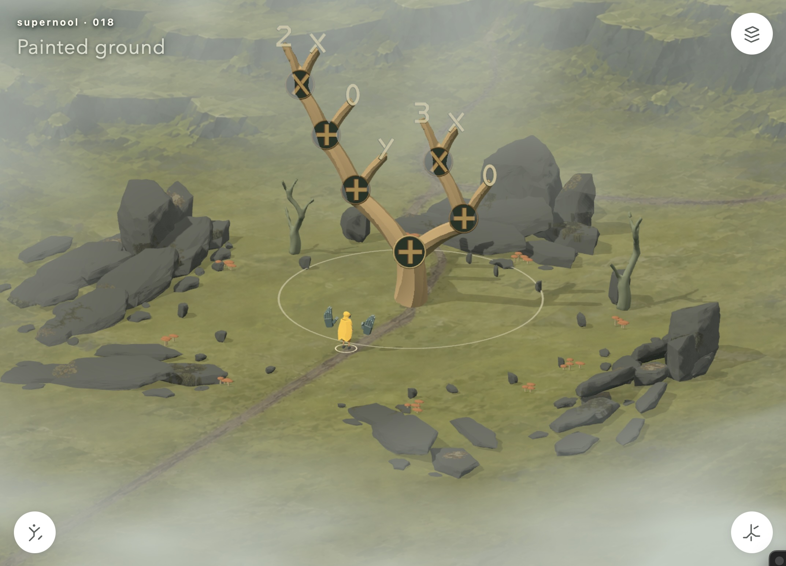

# supernool

prototype playable world exploring the premise of what if math was real. this is the super/3d version of [nool](https://github.com/disconcision/nool), which persists as interaction and symbolic manipulation lab.



## run

use Node.js 20+.

```sh
npm ci
npm run dev
```

open <http://127.0.0.1:3100/>. leads to **020 · Rewrite interactions**, the experimental playable scene. the [study catalogue](explorations/index.html) retains experiments 001–020, generated concepts, diagrams, review notes and screenshots.

walk toward the tree. press Space to enter hand control. arrows determine grip. hold Space to pull. colored dots show possible targets. release space to commit. escape exits. mouse interaction is also available; the three corner marks open controls.

## check and build

```sh
npm run check
npm test
npm run build
# if dev server running and chrome installed:
npm run test:browser
npm run test:body
```

## stuff

- `explorations/018-painted-ground/`: current game, geometry, interactions, character integration and local assets.
- `explorations/`: preserved studies, concepts and visual evidence.
- `design/`: direction, open questions and a saved discussion snapshot. Read `design/current-direction.md` before changing the visual or interaction approach.
- `assets/audio/`: shared recorded sound copied from og nool.
- `legacy/nool-world/`: original integrated solid/nool world prototype and its required 2D code, preserved independently. Run `npm ci` there, then `npm run dev -- --port 3101`, and visit `http://localhost:3101/?world`.
- `MIGRATION.md`: provenance and repository split details.

separate art research workspace remains in the sibling `grow-reference-lab-2026-09-06` directory. imported character and terrain handoffs used by the game are included here; their provenance accompanies the assets. That research task and its larger reference archive have not been relocated here.

keep meaningful changes in Git commits. preserve useful studies, but do not duplicate the entire playable scene for every adjustment. main retains stable iteration 019; this branch holds iteration 020. See [release boundaries](RELEASES.md).
