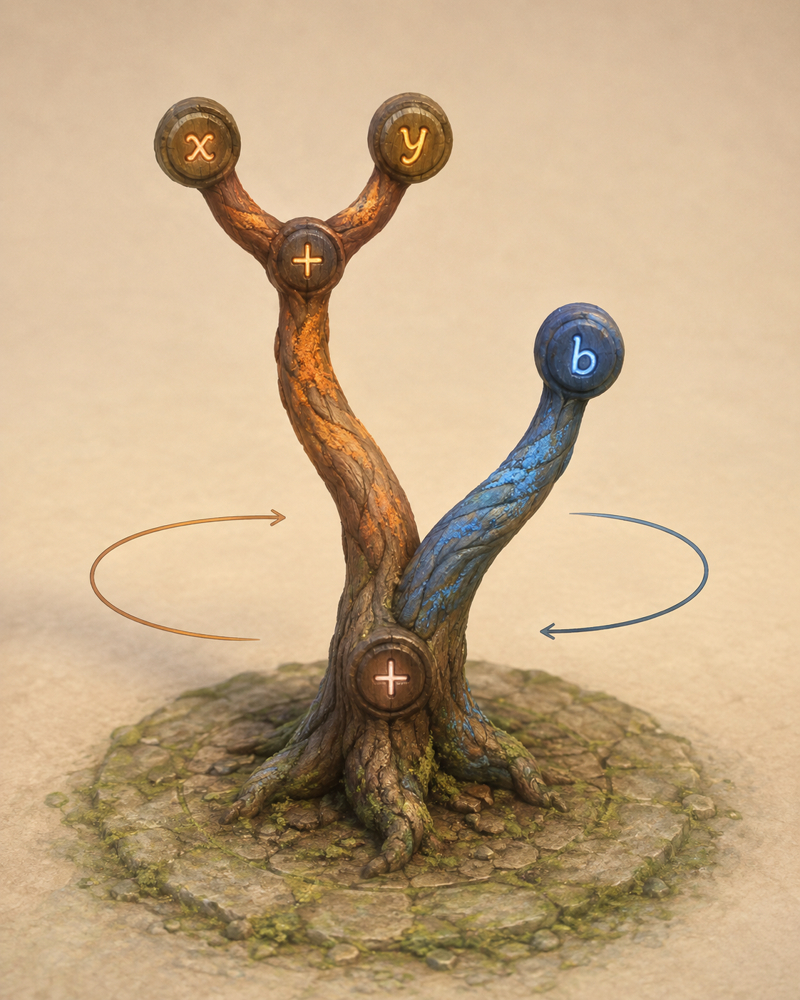
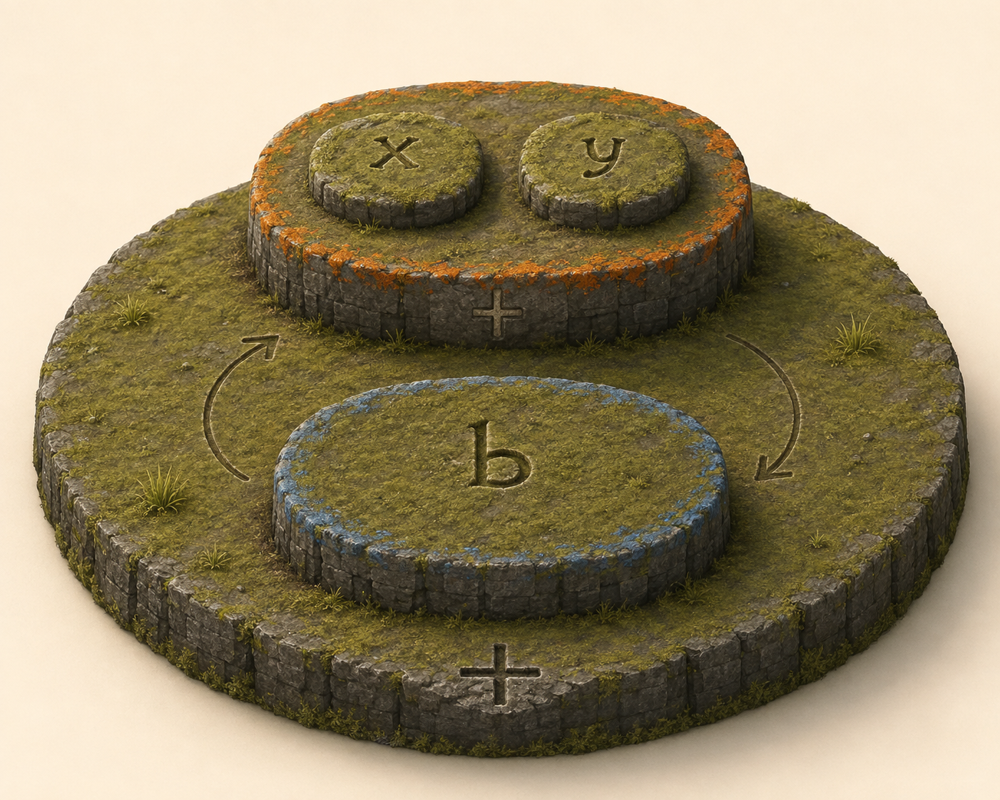

# 005 · Orbit material concepts

Two images generated with the built-in imagegen tool, using the explicit nested swap example from study 004. Complete prompts are in `prompts.md`. These are single-state material interpretations, not frame-accurate motion specifications.

## Tree

`tree.png`: the intended five-node topology is readable: two addition junctions, x and y terminals on the orange subtree, and one blue b terminal. Wood and rune treatment are useful. The composition is more frontal than requested, so it does not establish an unmistakable front/back swap midpoint. Arrows suggest orbiting but do not prove clearance or a viable deformation of the trunk junction.

## Plateaus

`concept.png`: the common base, two sibling operand platforms, and two children on the orange operand are retained. Solid mossy basalt shelves give a more concrete target than elaborate nested walls. The back/front separation is readable. The circular arrows are artistic suggestions, not calibrated paths; use study 004 for trajectories. Surface detail should travel with its operand, not be regenerated randomly during the swap.

Both outputs were inspected for added branches, changed operand structure, extra islands, and missing runes. Keep them as appearance references alongside the exact SVGs.
